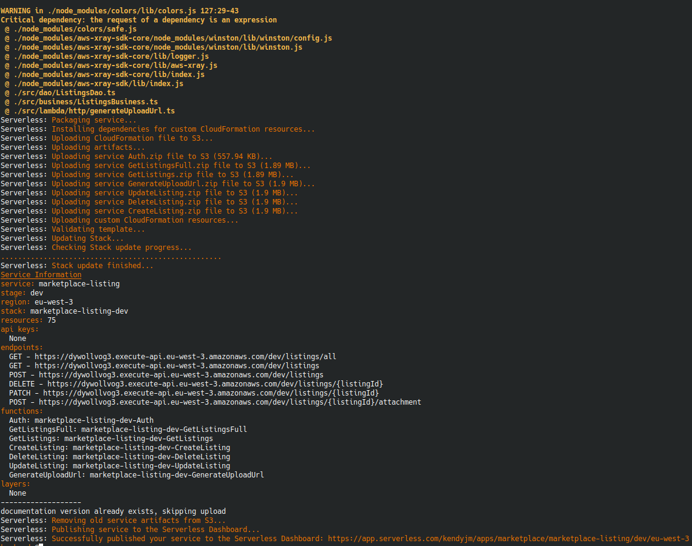
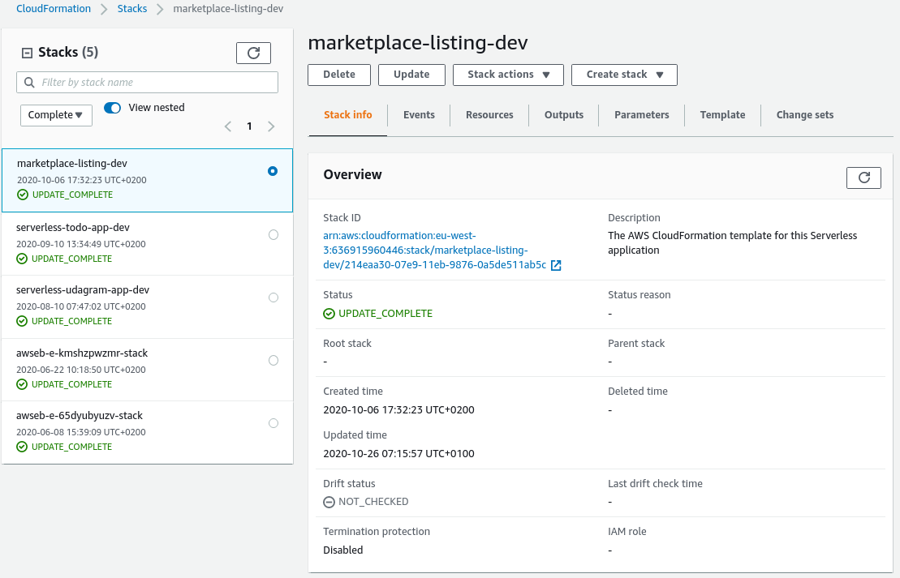
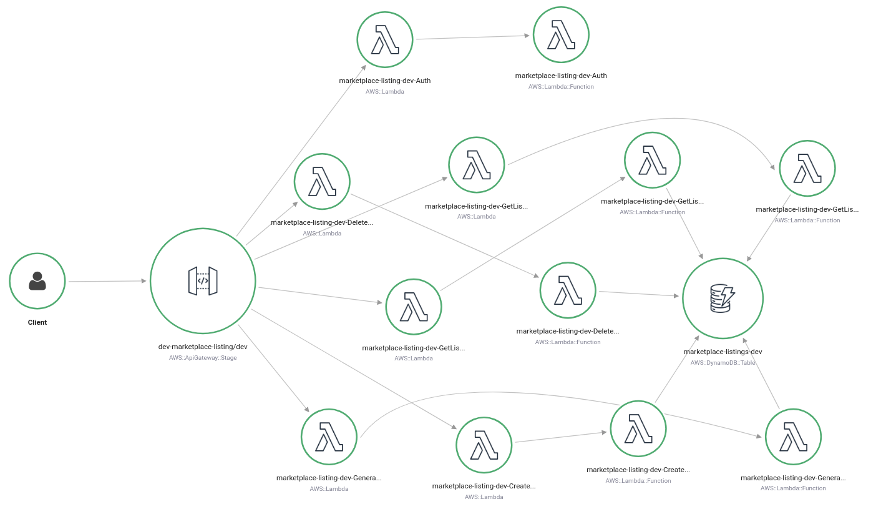
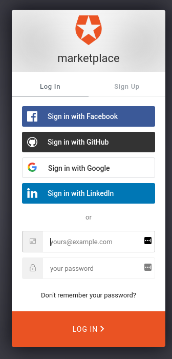
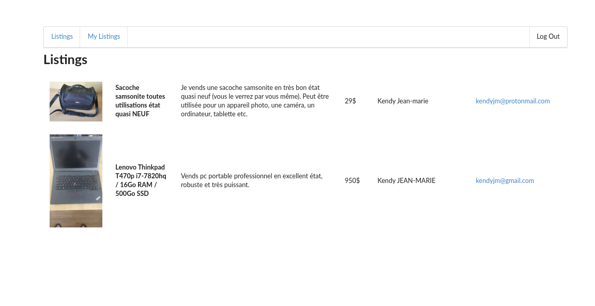
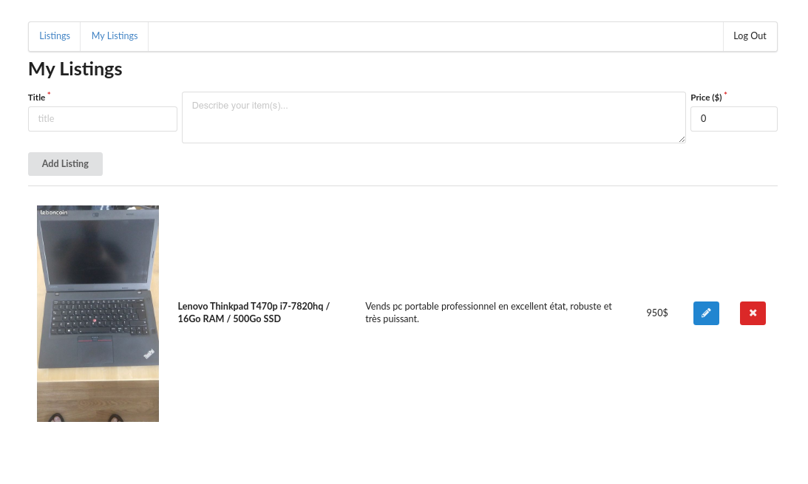

# Marketplace

- [Summary](#summary)
- [Requirements](#requirements)
- [Getting started](#getting-started)
  - [Installation](#installation)
  - [Serverless Deployment (Manual)](#serverless-deployment-manual)
  - [Serverless CD (configure online)](#serverless-cd-configure-online)
  - [Postman collection](#postman-collection)
  - [Client Local Start](#client-local-start)
- [Files](#files)
- [Contributing](#contributing)
- [License](#license)
- [Screenshots](#screenshots)
  - [Result of a Serverless deployment (sls deploy -v)](#result-of-a-serverless-deployment-sls-deploy--v)
  - [CloudFormation Stack for Serverless deployment](#cloudformation-stack-for-serverless-deployment)
  - [X-ray service map](#x-ray-service-map)
  - [Frontend](#frontend)

## Summary

This application is my capstone project for the [Udacity Cloud Developer Nanodegree](https://www.udacity.com/course/cloud-developer-nanodegree--nd9990)

Marketplace is a collaborative platform that essentially connects individuals wishing to sell or buy anything.
As a user, you can login, add a "listing" containing a description of the item(s) you're selling, and also look at listing posted by others, like a P2P marketplace.

It demonstrates

* AWS
  * Api Gateway (front-door securing, monitoring...the REST API)
  * Lambdas (serverless functions)
  * DynamoDB (database storing the listings)
  * S3 Bucket (storage of images)
  * Cloudformation (infrastructure as code, provisioning a collection of needed resources)
* [Serverless Framework](https://serverless.com/)
* WebApp Client
  * ReactJS
* [Auth0](https://auth0.com/)
  * 3rd party OAuth integration
* Optimisations
  * Global Secondary Indexes on DynamoDB
  * Individual packaging of Lambdas
  * X-ray to analyze and debug production, distributed applications

## Requirements

* [Node 12](https://nodejs.org/en/)
* [AWS Account](https://portal.aws.amazon.com/gp/aws/developer/registration/index.html)
* [AWS CLI](https://aws.amazon.com/cli/)
* [Serverless](https://serverless.com/framework/docs/getting-started/)
* [Auth0](https://auth0.com/)

## Getting started

### Installation

Use the node package manager to install _marketplace_

```bash
cd backend
npm install

cd ../frontend
npm install
```

### Serverless Deployment (Manual)

Firstly, the serverless application should be deployed to AWS.
Here I'm assuming that you have an AWS Profile of _serverless_ and are deploying to region _eu-west-3_.
The NODE_OPTIONS setting is to help avoid memory problems in Node when packaging the lambdas as separate deployables.

```bash
export NODE_OPTIONS=--max_old_space_size=8192
sls deploy -v
```

### Serverless CD (configure online)

Go to <https://dashboard.serverless.com/> and setup account/login.
Your deployed app should be available for easy setup of automated CD once it has been deployed manually.

### Postman collection

An alternative way to test the API, you can use the Postman collection that contains sample requests. You can find a [Postman collection](backend/marketplace.postman_collection.json) in this project.

### Client Local Start

1) Update the client/src/config.ts credentials to match your Auth0 account (for authentication) and Serverless deployment (for REST API calls)
2) The client can be installed and run locally

```bash
cd client
npm start
```

## Files

- __marketplace__
  - __backend__ (Serverless Stack)
    - [serverless.yml](backend/serverless.yml) (Serverless framework config file)
    - __src__
      - __auth__ (JWT handling)
      - __business__ (business layer)
      - __dao__ (dao layer, crud operations on dynamodb)
      - __lambda__ (Serverless lambdas)
        - __auth__ (API gateway token authorizer)
        - __http__ (separate HTTP handlers)
      - __models__ (Typescript interfaces)
      - __requests__ (Typescript interfaces)
      - __utils__ (Logging module)
      - __validation__ (JSON Schema validation)

## Contributing

Pull requests are welcome. For major changes, please open an issue first to discuss what you would like to change

Please make sure to update tests as appropriate

## License

[MIT](https://choosealicense.com/licenses/mit/)

## Screenshots

### Result of a Serverless deployment (sls deploy -v)



### CloudFormation Stack for Serverless deployment



### X-ray service map



### Frontend







